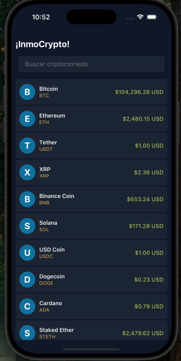
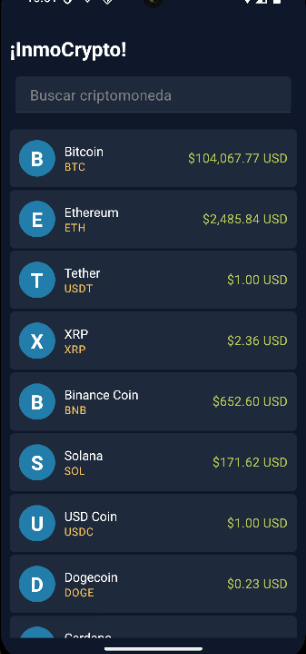
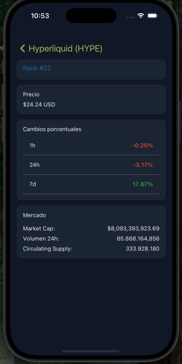
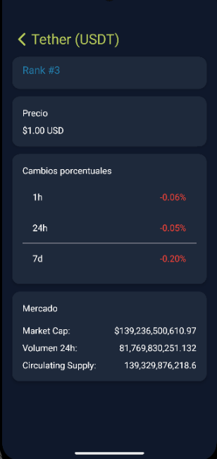

# InmoCrypto

Esta aplicación móvil en React Native (v0.79.2) muestra cotizaciones de criptomonedas en USD.

---

## 📋 Requisitos Previos

- **Node.js** >= 18.x
- **Yarn** o **npm**
- **Watchman** (recomendado en macOS)
- **React Native CLI** compatible con RN 0.79.2
- **Android Studio** (para Android)
- **Xcode** 14.x o superior (para iOS en macOS)

---

## 🚀 Pasos para Descargar y Ejecutar Localmente

1. **Clonar el repositorio**
   ```bash
   git clone https://github.com/Nestrra/InmoCrypto.git
   cd InmoCrypto
   ```

2. **Instalar dependencias**
   ```bash
   npm install       # o yarn install
   ```

3. **Configurar iOS (solo macOS)**
   ```bash
   cd ios
   pod install 
   cd ..
   ```

4. **Ejecutar en Android**
   - Inicia un emulador o conecta un dispositivo USB.
   - En la raíz del proyecto:
     ```bash
     npx react-native run-android
     ```

5. **Ejecutar en iOS (solo macOS)**
   - Desde la raíz del proyecto:
     ```bash
     npx react-native run-ios 
     ```
   - O abre `ios/InmoCrypto.xcworkspace` en Xcode y presiona **Run**.

6. **Uso de la App**
   - La pantalla principal lista las criptomonedas con su precio en USD.
   - Puedes filtrar escribiendo en el buscador.
   - Al pulsar una moneda, entras al detalle con información extendida.

---

## 🖼️ Imágenes 


   
   
    
   


## 📞 Contacto

Para cualquier duda o reporte, contacta a **[nestrra@gmail.com](mailto:nestrra@gmail.com)**.

---

## 🧪 Pruebas Unitarias

El proyecto incluye pruebas unitarias con Jest y TypeScript para validar la lógica de mapeo y casos de uso.


 **Estructura de tests**:


     __tests__/
     ├── CryptoMapper.test.ts
     └── getCryptoList.test.ts

  
 **Ejecutar todas las pruebas**:
   ```bash
   npm test
   ```

---